# Лабораторная работа №1 — Chroma key

**Дисциплина:** Системы компьютерной обработки изображений  
**Вариант:** 5  
**Выполнил:** Молчанов Федор Денисович, P3413  
**Преподаватель:** Денисов Алексей Константинович

## Цель и постановка задачи

Цель работы — изучить практическую реализацию алгоритма обработки изображений и сравнить быстродействие библиотечного и нативного подходов.

В соответствии с вариантом 5 требуется реализовать chroma key: программа получает два изображения и задаваемый пользователем интервал цвета. Пиксели первого изображения, попавшие в этот интервал, заменяются пикселями второго изображения. Один и тот же алгоритм должен быть реализован средствами библиотеки и нативно на языке программирования.

## Теоретическая база

Chroma key — способ композиции двух изображений, при котором область определённого цвета на переднем плане заменяется фоном. На практике часто используется зелёный фон: этот цвет обычно хорошо отличается от оттенков человеческой кожи, а зелёный канал цифровой камеры содержит высокий уровень детализации.

Пусть $F(x,y)=(R_F,G_F,B_F)$ — пиксель исходного изображения, $B(x,y)$ — пиксель фона, а $L=(R_L,G_L,B_L)$ и $U=(R_U,G_U,B_U)$ — нижняя и верхняя границы RGB. Маска равна единице, если одновременно выполняются три неравенства:

$$
R_L \le R_F \le R_U,\qquad
G_L \le G_F \le G_U,\qquad
B_L \le B_F \le B_U.
$$

Иначе маска равна нулю. Итоговое изображение вычисляется поканально:

$$
I(x,y)=M(x,y)B(x,y)+(1-M(x,y))F(x,y).
$$

Границы интервала включены. Интервал необходим из-за неравномерного освещения, теней, шумов сенсора и сжатия. Модель выполняет жёсткое переключение пикселей. В промышленных системах дополнительно применяют размытие границы маски и подавление зелёного оттенка на объекте.

## Описание разработанной системы

Программа разработана на Python 3.14 с использованием NumPy и OpenCV. Модуль `chroma_key.py` содержит две реализации, функции чтения и записи и CLI. Вычисления выполняются в RGB. OpenCV читает файлы в порядке BGR, поэтому после чтения выполняется преобразование в RGB, а перед сохранением — обратное преобразование.

Если размеры изображений различаются, второе изображение масштабируется до размера первого. Эта операция относится к общей подготовке данных и не включается в сравниваемую часть алгоритма.

### Нативная реализация

`chroma_key_native` выполняет два вложенных цикла. Для каждого пикселя вручную проверяются три компоненты RGB. При выполнении всех условий пиксель результата берётся из фонового изображения.

```python
for y in range(height):
    for x in range(width):
        red, green, blue = (int(c) for c in foreground[y, x])
        if (lower[0] <= red <= upper[0]
                and lower[1] <= green <= upper[1]
                and lower[2] <= blue <= upper[2]):
            result[y, x] = background[y, x]
```

### Библиотечная реализация

`chroma_key_opencv` строит маску вызовом `cv2.inRange`. Затем `cv2.copyTo` копирует фон в позиции, где маска ненулевая. Цикл выполняется внутри скомпилированной библиотеки.

```python
mask = cv2.inRange(foreground, lower, upper)
result = foreground.copy()
cv2.copyTo(background, mask, result)
```

### Установка и запуск

```bash
python3 -m venv .venv
.venv/bin/pip install -r requirements.txt
.venv/bin/python chroma_key.py foreground.png background.png result.png \
  --lower 0,70,0 --upper 170,255,180 --method opencv
```

Для нативной реализации используется `--method native`. Проверки и эксперименты:

```bash
.venv/bin/pytest -q
.venv/bin/python benchmark.py
.venv/bin/python interval_experiments.py
```

## Результаты работы и тестирования

Использованы фотографии `pic1.jpg` и `pic2.jpg`. Широкий интервал равен `(0,70,0)`–`(170,255,180)`, а новым фоном служит цветной градиент.

| `pic1.jpg` | `pic2.jpg` |
|:---:|:---:|
| 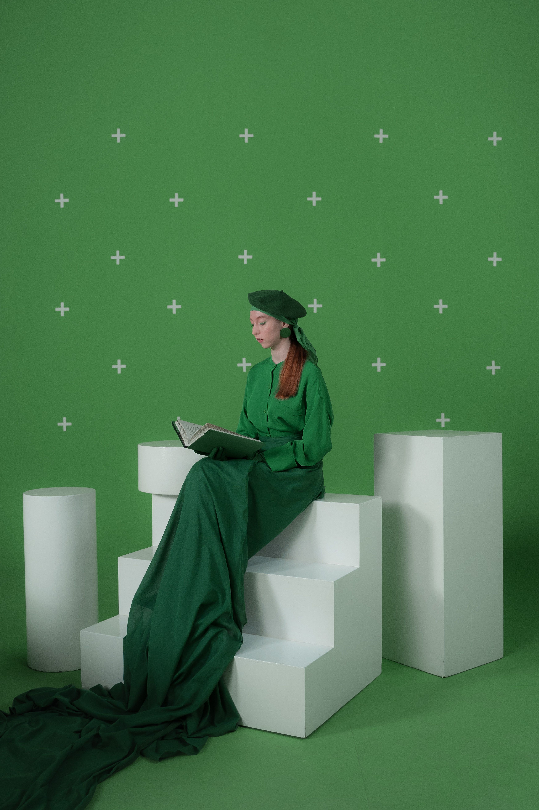 | 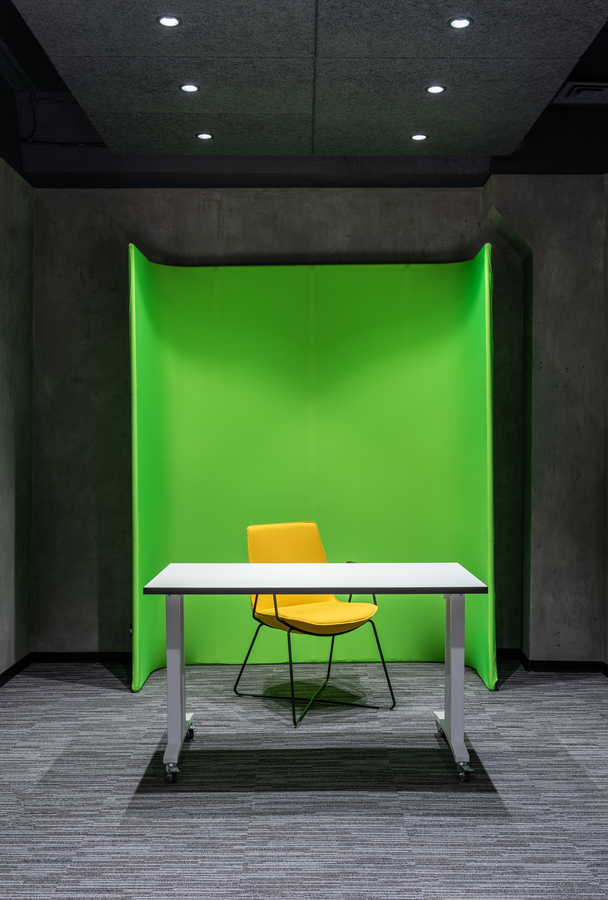 |

| Результат для `pic1` | Результат для `pic2` |
|:---:|:---:|
| 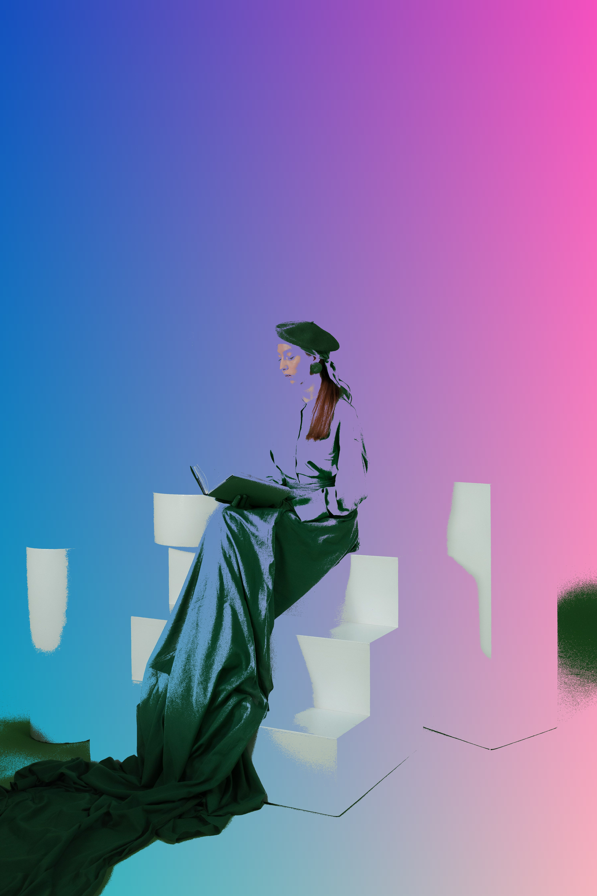 | 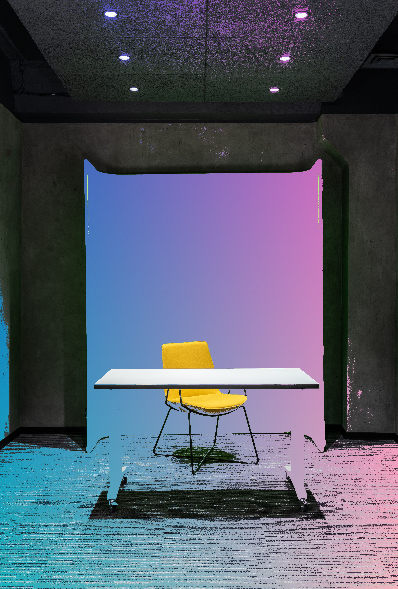 |

На первой фотографии одежда модели содержит зелёные оттенки, поэтому её части также были заменены. Алгоритм классифицирует только цвет пикселя и не знает, является он фоном или объектом.

### Влияние ширины цветового интервала

Выбраны конкретные часто встречающиеся цвета хромакея: `(70,129,71)` для `pic1` и `(105,187,59)` для `pic2`. Проверены точное совпадение, отклонения ±5 и ±20 по каждому каналу и широкий интервал.

#### `pic1`: точный цвет, ±5, ±20, широкий интервал

| Точный цвет | ±5 | ±20 | Широкий |
|:---:|:---:|:---:|:---:|
| 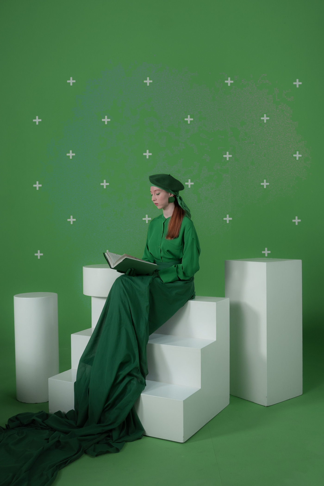 | 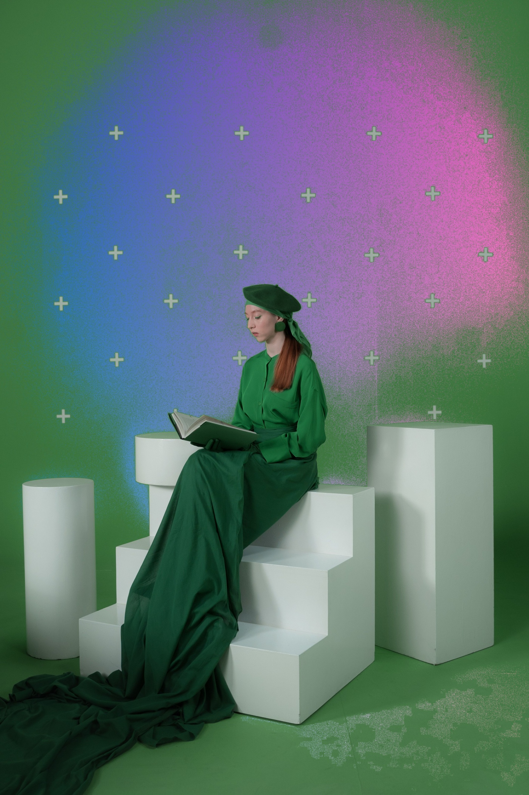 | 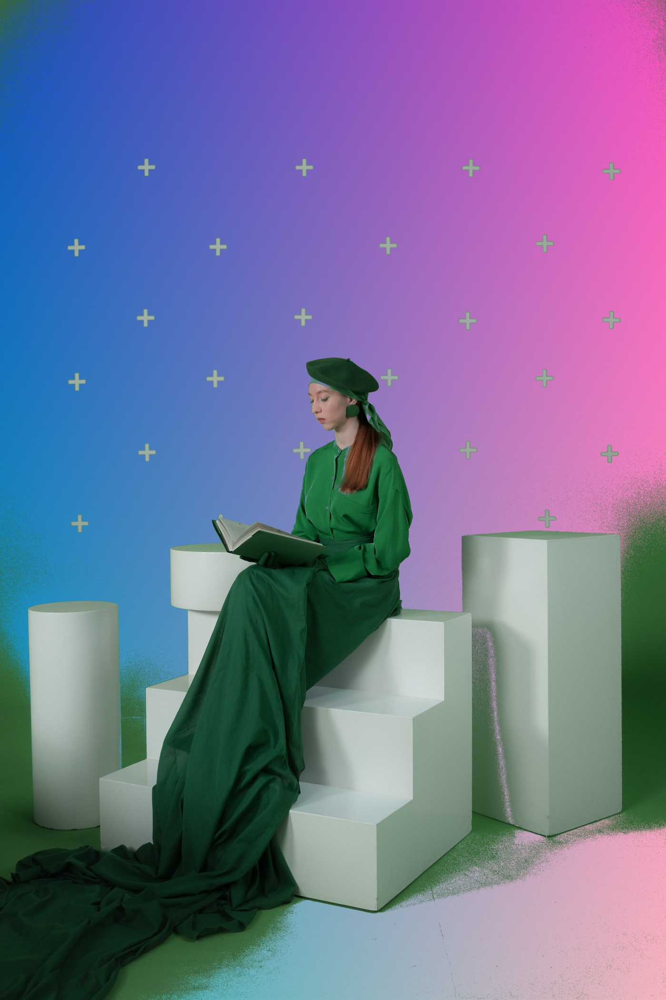 |  |

#### `pic2`: точный цвет, ±5, ±20, широкий интервал

| Точный цвет | ±5 | ±20 | Широкий |
|:---:|:---:|:---:|:---:|
|  | 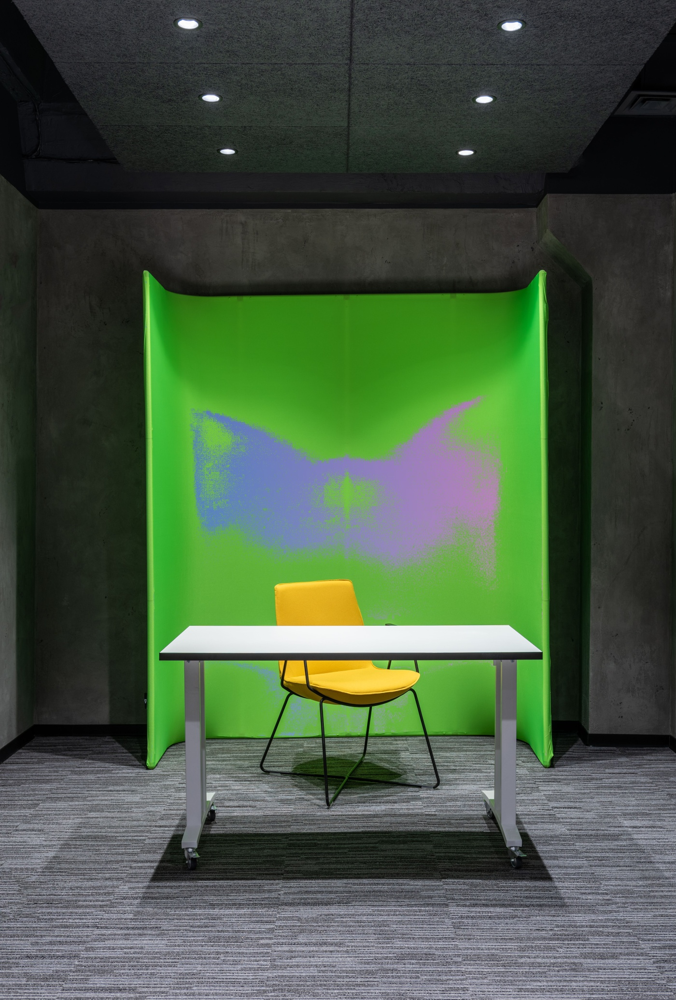 | 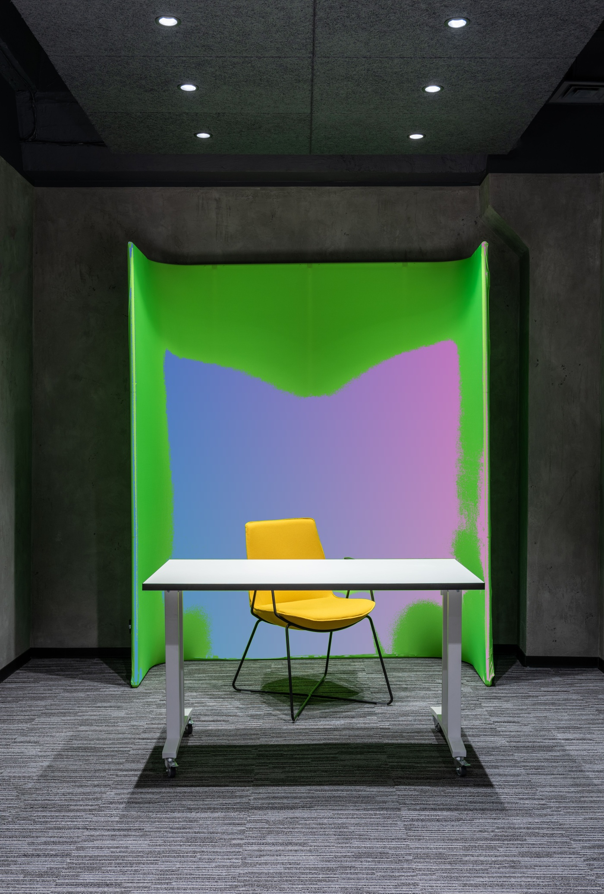 | 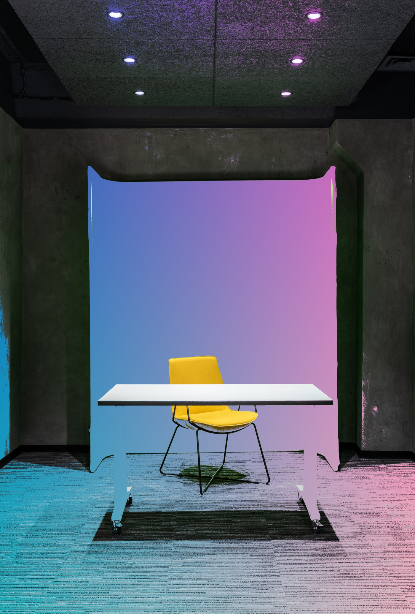 |

| Фото | Вариант | Интервал RGB | Пикселей | Доля, % |
|---|---|---|---:|---:|
| `pic1` | Точный | `(70,129,71)` | 356 097 | 1,941 |
| `pic1` | ±5 | `(65,124,66)`–`(75,134,76)` | 5 795 080 | 31,595 |
| `pic1` | ±20 | `(50,109,51)`–`(90,149,91)` | 11 299 061 | 61,603 |
| `pic1` | Широкий | `(0,70,0)`–`(170,255,180)` | 15 304 648 | 83,442 |
| `pic2` | Точный | `(105,187,59)` | 36 552 | 0,109 |
| `pic2` | ±5 | `(100,182,54)`–`(110,192,64)` | 1 485 015 | 4,413 |
| `pic2` | ±20 | `(85,167,39)`–`(125,207,79)` | 3 969 129 | 11,794 |
| `pic2` | Широкий | `(0,70,0)`–`(170,255,180)` | 14 038 917 | 41,715 |

Даже точный цвет встречается многократно. Однако результат имеет вид отдельных пятен, поскольку освещение, тени и JPEG-сжатие создают близкие оттенки. Расширение интервала делает область связной, но повышает риск удалить зелёные детали объекта. Границы являются компромиссом между полнотой удаления фона и сохранением объекта.

### Автоматические тесты

Тесты проверяют включение границ интервала, сохранение остальных пикселей, несовпадающие размеры массивов, разбор RGB и полное совпадение реализаций на случайном изображении. Выполнено 5 тестов, все пройдены.

### Сравнение быстродействия

Измерено время одного запуска каждого метода на полном разрешении. Масштабирование фона и запись файлов не входят в замер. Перед сохранением проверяется попиксельное равенство результатов.

| Размер | Python, мс | OpenCV, мс | Ускорение |
|---|---:|---:|---:|
| 3497×5245 | 25 388,586 | 29,458 | 861,9× |
| 4773×7051 | 42 244,441 | 66,722 | 633,1× |

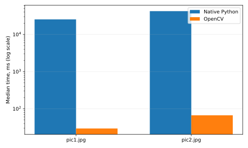

OpenCV работает на два-три порядка быстрее. Конкретные значения зависят от процессора, версий библиотек и фоновой нагрузки; `benchmark.py` сохраняет исходные результаты в CSV.

## Выводы

Реализован chroma key с явным обходом пикселей на Python и средствами OpenCV. Тесты подтвердили эквивалентность реализаций. Пользователь задаёт включительный RGB-интервал и выбирает алгоритм через CLI.

Нативные циклы подходят для демонстрации логики, но плохо масштабируются. OpenCV на реальных фотографиях оказался в 633–862 раза быстрее. Для практической обработки предпочтительна библиотечная реализация, а нативная полезна как эталон и учебная модель.

## Использованные источники

1. [OpenCV — Operations on arrays: inRange, copyTo](https://docs.opencv.org/4.x/d2/de8/group__core__array.html).
2. [OpenCV — Changing Colorspaces](https://docs.opencv.org/4.x/df/d9d/tutorial_py_colorspaces.html).
3. [NumPy — Array objects](https://numpy.org/doc/stable/reference/arrays.html).
4. [Python — time.perf_counter](https://docs.python.org/3/library/time.html#time.perf_counter).
