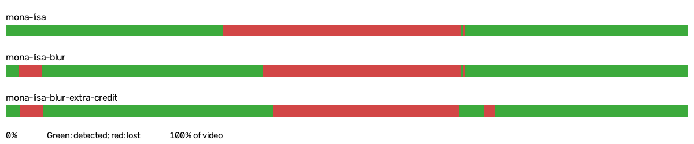
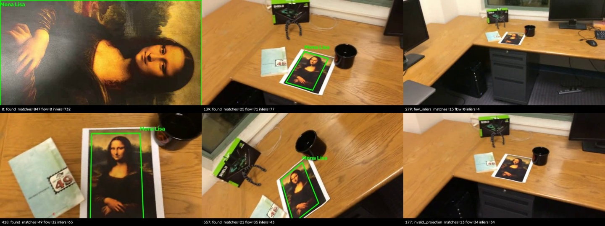
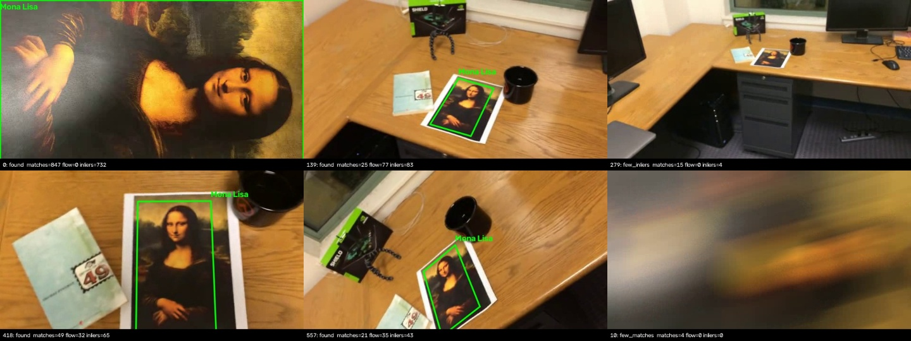
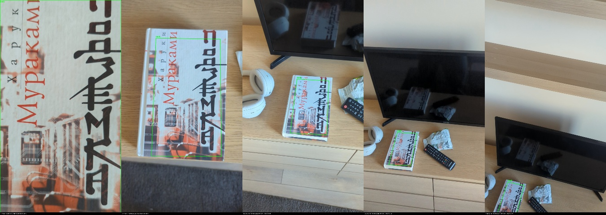

# Отчёт по лабораторной работе № 2

**Университет ИТМО**  
**Дисциплина:** Системы компьютерной обработки изображений  
**Вариант:** —  
**Выполнил:** Молчанов Федор Денисович, P3413  
**Преподаватель:** Денисов Алексей Константинович  
**Санкт-Петербург, 2026**

## 1. Цель и постановка задачи

Цель работы — реализовать трекинг плоского текстурированного объекта на видео по ключевым точкам. Первый кадр задаёт эталон. На следующих кадрах программа должна находить объект и выводить подписанную рамку, учитывающую его поворот, масштаб и перспективу.

Разработана программа на Python с использованием OpenCV и NumPy. Основной режим не требует ручного выделения: эталоном является весь первый кадр. Дополнительно реализован режим выбора прямоугольной области объекта мышью или параметрами. Проверка выполнена на трёх исходных видео из задания и собственной записи `my_video.mp4` с текстурированной обложкой книги.

## 2. Теоретическая база

### 2.1. Ключевые точки и дескрипторы SIFT

Ключевая точка — локальная особенность изображения, которую можно повторно найти при изменении условий съёмки. SIFT ищет экстремумы разности гауссовых изображений в пространстве масштабов, отбрасывает неустойчивые точки и определяет доминирующее направление градиента. Это позволяет учитывать масштаб и поворот. Дескриптор содержит 128 компонент, описывающих локальные направления градиентов.

Текст, рисунки и неоднородные текстуры дают больше различимых признаков, чем однотонные поверхности. Смазывание и сильное уменьшение объекта уничтожают детали и ухудшают сопоставление.

Сопоставление выполняется по евклидовому расстоянию между дескрипторами. Для каждого эталонного дескриптора находятся два ближайших дескриптора кадра. Соответствие принимается, если

$$
d_1 < \rho d_2, \qquad \rho = 0.75.
$$

Такая проверка отбрасывает неоднозначные соответствия. Затем для каждой ключевой точки текущего кадра сохраняется только лучшее соответствие с эталоном. Описание SIFT и проверки отношений расстояний приведено в источниках [1](https://www.cs.ubc.ca/~lowe/papers/ijcv04.pdf) и [2](https://docs.opencv.org/4.13.0/da/df5/tutorial_py_sift_intro.html).

### 2.2. Гомография и RANSAC

Для плоского объекта изменение положения камеры описывается проективным преобразованием. Однородные координаты точек связаны выражением

$$
\lambda
\begin{pmatrix}
x' \\
y' \\
1
\end{pmatrix}
= H
\begin{pmatrix}
x \\
y \\
1
\end{pmatrix},
$$

где $H$ — матрица гомографии размером $3 \times 3$. После преобразования координаты делятся на третью компоненту. Для определения гомографии нужны как минимум четыре соответствия в невырожденной конфигурации.

Ошибочные сопоставления исключаются методом RANSAC: модель оценивается по случайным подмножествам точек, затем определяется согласованный набор соответствий — инлайеры. В программе допустимая ошибка репроекции составляет 3 пикселя. Для вывода рамки требуется не менее 8 инлайеров и доля инлайеров не ниже 0.45 среди объединённых соответствий.

Четыре угла эталонного прямоугольника преобразуются найденной гомографией. Получается четырёхугольник, а не прямоугольник, параллельный осям кадра. Применение гомографии для локализации объекта описано в источниках [3](https://docs.opencv.org/4.12.0/d1/de0/tutorial_py_feature_homography.html) и [4](https://docs.opencv.org/4.13.0/d9/dab/tutorial_homography.html).

### 2.3. Оптический поток

Пирамидальный метод Лукаса — Канаде переносит точки между соседними кадрами, используя локальную близость яркостей и предположение о сходном движении соседних пикселей. Пирамида изображений помогает учитывать более крупные перемещения. В реализации точка сначала переносится вперёд, затем обратно. Она сохраняется при успешном вычислении в обоих направлениях, ошибке возврата менее 1.5 пикселя и средней ошибке яркости окна менее 30.

Оптический поток дополняет сопоставление с первым кадром при уменьшении объекта. Он может накапливать ошибки, поэтому перенесённые точки проходят общую проверку RANSAC и геометрические ограничения. При потере объекта накопленные точки сбрасываются. Теория и библиотечная реализация приведены в источнике [5](https://docs.opencv.org/4.13.0/d4/dee/tutorial_optical_flow.html).

## 3. Описание разработанной системы

### 3.1. Архитектура

Файл [tracker.py](tracker.py) содержит класс `PlanarTracker`, структуру результата `Detection`, функцию обработки видео `run_video` и интерфейс командной строки. Класс хранит эталонные дескрипторы и координаты точек, а также состояние предыдущего кадра для оптического потока. Для всех перенесённых точек сохраняются исходные координаты в эталоне: гомография оценивается сразу между эталоном и текущим кадром, без перемножения последовательных матриц.

Файл [benchmark.py](benchmark.py) выполняет одинаковый эксперимент для трёх исходных роликов, формирует сводную статистику и иллюстрации. Файл [test_tracker.py](test_tracker.py) содержит автоматические проверки на данных с известным преобразованием: он импортирует реализацию из `tracker.py` и проверяет её результаты. Это набор тестов, а не отдельная реализация трекера.

Зависимости зафиксированы в [requirements.txt](requirements.txt) и установлены в локальном окружении `.venv`.

### 3.2. Последовательность обработки

1. Считать первый кадр; использовать его полностью либо выделенную область.
2. Перевести эталон в оттенки серого. Вычислить SIFT для масштабов 1, 0.5 и 0.25, если меньшая сторона изображения после уменьшения не меньше 32 пикселей. Координаты точек уменьшенных копий вернуть в систему координат исходного эталона. Такая подготовка учитывает потерю мелких деталей при удалении камеры.
3. На каждом кадре вычислить SIFT и сопоставить дескрипторы методом полного перебора `BFMatcher` с метрикой L2 и проверкой отношения расстояний.
4. Если предыдущая локализация успешна, перенести её точки оптическим потоком и проверить перенос в обратном направлении. Объединить эти соответствия с соответствиями SIFT. Удалить повторы по ячейкам 2 пикселя в эталоне и 1 пиксель в текущем кадре, отдавая приоритет свежим соответствиям SIFT.
5. Оценить гомографию через `findHomography` с RANSAC. Проверить число и долю инлайеров, медиану ошибки репроекции и распределение точек по эталону.
6. Преобразовать углы эталона. Отбросить невыпуклые, вырожденные, чрезмерно большие рамки и проекции через бесконечность. Убедиться, что рамка пересекает изображение.
7. Нарисовать зелёную рамку и подпись при успешной локализации. При неудаче вывести статус без рамки и сбросить точки оптического потока. Поиск SIFT по неизменному эталону продолжить на следующем кадре.
8. Записать обработанный кадр, покадровые показатели и итоговую статистику.

По умолчанию SIFT использует `nfeatures=2500` для каждого масштаба эталона и каждого текущего кадра, `contrastThreshold=0.02`. Для RANSAC заданы 2000 итераций и вероятность 0.995. Выпуклая оболочка эталонных инлайеров должна покрывать хотя бы 1% площади эталона; медиана ошибки репроекции не должна превышать 3 пикселя. Допустимая площадь рамки — от 64 пикселей до четырёх площадей кадра. Видимая часть должна иметь площадь не менее 64 пикселей. Эти ограничения являются эвристиками, а не доказательством правильности локализации.

Оптический поток использует окно $21 \times 21$, `maxLevel=3`, не более 30 итераций и точность остановки 0.01. Между кадрами сохраняется не более 500 инлайеров для ограничения времени вычисления.

### 3.3. Установка и запуск

Все команды выполняются из каталога лабораторной работы:

```sh
python3 -m venv .venv
.venv/bin/python -m pip install -r requirements.txt
.venv/bin/python tracker.py test-videos/mona-lisa.avi --label "Mona Lisa"
```

Результат сохраняется в `results/mona-lisa/`. Файл `tracked.mp4` содержит видео с рамкой; `frames.csv` — покадровые результаты, `summary.json` — статистику. Также сохраняются первый кадр, несколько кадров результата и первый кадр потери объекта, если потеря произошла. Видео сохраняет размер кадров и FPS источника, но не переносит аудиодорожку.

Для вывода окна при обработке используется `--show`. Клавиши Q и Esc завершают просмотр и обработку досрочно. Основной запуск работает без графического окна.

Дополнительный режим с выбором области мышью:

```sh
.venv/bin/python tracker.py my_video.mp4 --select-roi --label "Book" --output-dir results/my_video_roi
```

На первом кадре нужно протянуть прямоугольник левой кнопкой мыши и подтвердить его клавишей Enter или пробелом. Esc отменяет выделение. Этот режим требует доступного графического рабочего стола. В примере указан отдельный каталог результатов для сравнения с основным режимом.

Ту же область можно задать числами:

```sh
.venv/bin/python tracker.py my_video.mp4 --roi 100 60 400 250 --label "Book" --output-dir results/my_video_roi
```

Здесь 100 и 60 — координаты левого верхнего угла, 400 и 250 — ширина и высота в пикселях. Начало координат находится слева сверху; X растёт вправо, Y — вниз. Пример поясняет формат параметра, а не задаёт фактические границы книги; собственное видео в отчёте проверено без ручной области.

Параметр `--label` задаёт только подпись у рамки. Он не меняет алгоритм или каталог результатов. По умолчанию каталог определяется именем входного файла без расширения; для `my_video.mp4` это `results/my_video/`. Параметр `--output-dir` позволяет задать другой каталог.

Полный повтор эксперимента и автоматические проверки:

```sh
.venv/bin/python benchmark.py
.venv/bin/python -m unittest -v test_tracker
```

## 4. Результаты работы и тестирования

### 4.1. Условия эксперимента

Для тестирования использованы `mona-lisa.avi`, `mona-lisa-blur.avi` и `mona-lisa-blur-extra-credit.avi`. Во всех роликах объектом является плоская репродукция Моны Лизы; первый кадр задаёт эталон без ручной области. `simple_track.avi` содержит уже нанесённые рамку и ключевые точки и рассматривается как приложенный образец результата, а не четвёртый исходный тест.

Во всех экспериментах использованы одинаковые параметры. Для измерения времени `benchmark.py` устанавливает один поток OpenCV и фиксирует начальное состояние генератора случайных чисел OpenCV. Скорость ниже характеризует вычисление локализации: чтение, рисование рамки и кодирование видео в неё не входят. Абсолютное время зависит от компьютера и нагрузки. Эксперимент проведён на AMD Ryzen 7 5825U; вычисления выполнялись на CPU.

Версии среды: Python 3.14.7, OpenCV 5.0.0, NumPy 2.5.3. Размер кадров — 640 × 360; частота — 29.97 кадр/с.

### 4.2. Количественные результаты

| Видео | Найдено / всего | Доля, % | Ошибка, px | Скорость, FPS |
| --- | ---: | ---: | ---: | ---: |
| Обычное видео (`mona-lisa.avi`) | 362 / 558 | 64.87 | 0.92 | 15.29 |
| Размытие (`mona-lisa-blur.avi`) | 376 / 558 | 67.38 | 0.91 | 14.91 |
| Усложнённое размытие (`mona-lisa-blur-extra-credit.avi`) | 378 / 558 | 67.74 | 0.89 | 15.63 |

Числа приведены по [results/benchmark.json](results/benchmark.json).

Доля найденных кадров — число кадров с принятой рамкой, делённое на число обработанных кадров, включая первый эталонный кадр. Это показатель доступности локализации, а не точность детектора: он не отличает правильную рамку от ложной. Для объективной оценки точности границ нужны вручную размеченные углы объекта или полигоны и отдельная оценка ошибки углов либо IoU.

В столбце «Ошибка» приведена медиана покадровых медиан ошибки репроекции инлайеров для кадров с принятой рамкой. Она отражает согласованность точек с найденной гомографией и не является ошибкой границ относительно ручной разметки. При использовании оптического потока небольшая ошибка репроекции сама по себе не исключает накопления смещения рамки.



Зелёным отмечены принятые рамки, красным — потери. Горизонтальная ось показывает относительное время ролика.

### 4.3. Примеры локализации

Иллюстрации содержат первый кадр, кадры примерно на 25%, 50%, 75% длительности и последний кадр. Шестая ячейка показывает первую потерю объекта, если она была; иначе остаётся пустой. Нижняя строка каждого кадра содержит статус, число соответствий SIFT (`matches`), число точек потока (`flow`) и число инлайеров (`inliers`).

**Обычное видео:**



[Обработанное видео](results/mona-lisa/tracked.mp4) · [Покадровые результаты](results/mona-lisa/frames.csv)

**Видео с размытием:**



[Обработанное видео](results/mona-lisa-blur/tracked.mp4) · [Покадровые результаты](results/mona-lisa-blur/frames.csv)

**Усложнённое видео с размытием:**


[Обработанное видео](results/mona-lisa-blur-extra-credit/tracked.mp4) · [Покадровые результаты](results/mona-lisa-blur-extra-credit/frames.csv)

При удалении камеры объект занимает меньшую часть кадра, поэтому количество устойчивых признаков уменьшается. Оптический поток позволяет использовать соответствия соседних кадров, даже когда прямое сопоставление SIFT с эталоном ослабевает. При смазывании потери остаются возможными. При повторном появлении достаточных признаков объект заново локализуется по первому кадру.

На приведённых примерах рамка отсутствует около середины всех трёх роликов, хотя репродукция ещё различима визуально. Таким образом, требование локализации на каждом кадре с видимым объектом достигается не во всех условиях. Граница эталона соответствует изображению первого кадра, поэтому она может проходить внутри белой окантовки листа, которая не была включена в эталон.

### 4.4. Автоматические проверки

Выполнены шесть автоматических проверок в `test_tracker.py`:

1. Синтетический текстурированный объект преобразован известной гомографией. Проверено обнаружение и отклонение каждого угла менее 3 пикселей, затем исчезновение рамки на пустом кадре и обнаружение после возвращения объекта.
2. Для области `(70, 40, 250, 200)` проверено соответствие найденной рамки координатам области исходного кадра с допустимым отклонением 1 пиксель.
3. Проверены отказ на однотонном эталоне и отклонение областей с недопустимыми координатами или размерами.
4. Проверена обработка короткого видео из трёх кадров: объект, пустой кадр, объект. Ожидаемые статусы — обнаружен, потерян, обнаружен. Выходное видео повторно декодировано; проверены число кадров и сохранение частоты 15 кадр/с.
5. Проверено отсутствие рамки на постороннем текстурированном кадре после успешного обнаружения эталона.
6. Проверена последовательность из десяти известных перспективных преобразований: оптический поток участвует в локализации, а ошибка каждого угла остаётся меньше 3 пикселей.

Все шесть проверок прошли. Они подтверждают конкретные свойства реализации, но не заменяют оценку на реальных сценах. Интерактивное выделение мышью требует отдельной проверки на рабочем столе; вычислительная часть выбора области проверена автоматически через координаты ROI.

### 4.5. Собственное видео

Собственная запись [my_video.mp4](my_video.mp4) показывает книгу с обложкой, содержащей рисунок, надписи и контрастные детали. Объект лежит на столе. После крупного плана камера отдаляется и меняет угол; в кадре появляются монитор, наушники, пульт и другие предметы. Книга остаётся видимой на приведённых примерах.

Запись обработана в основном режиме, без ручного выделения:

```sh
.venv/bin/python tracker.py my_video.mp4 --label "Book"
```

Параметр подписи не влияет на приведённые показатели. Результаты взяты из уже полученных файлов [summary.json](results/my_video/summary.json) и [frames.csv](results/my_video/frames.csv). Размер кадров — 1080 × 1920, частота — 29.97 кадр/с, длительность — около 10.38 с. Эталон содержит 5081 ключевую точку по трём масштабам. Параметры локализации совпадают с параметрами тестов на приложенных роликах.

| Найдено / всего | Доля, % | Ошибка, px | Скорость, FPS |
| ---: | ---: | ---: | ---: |
| 311 / 311 | 100 | 0.64 | 3.72 |

Обработаны все 311 кадров. Потерь по критерию принятия рамки нет. Среднее время вычисления локализации — 269.17 мс на кадр; полное время обработки, записанное программой, — 90.43 с. Исходная запись имеет существенно большее разрешение, чем тестовые ролики, поэтому напрямую сравнивать скорость без учёта размера кадра нельзя. Метрики собственной записи получены отдельным запуском пользователя; ограничение OpenCV одним потоком в `benchmark.py` относится к трём приложенным роликам.



[Обработанное собственное видео](results/my_video/tracked.mp4)

На выборочных кадрах рамка остаётся на изображении обложки при удалении камеры и изменении перспективы. Однако первый кадр показывает обложку не целиком: часть её границ находится за пределами изображения. Поэтому рамка соответствует видимому фрагменту первого кадра и на последующих кадрах может проходить внутри краёв книги. Это ограничение выбора эталона, а не доказательство точного восстановления полной границы предмета.

Доля 100% означает наличие принятой рамки на каждом кадре, а не подтверждённую ручной разметкой точность границ. На этой записи также не проверено повторное обнаружение после полного исчезновения объекта: потерь не зарегистрировано. Такое восстановление проверено отдельно автоматическими тестами.

## 5. Выводы по работе

Разработана программа трекинга плоского объекта по ключевым точкам. Рамка вычисляется через гомографию и учитывает перспективу. Основной режим использует первый кадр без ручного выделения; дополнительный режим позволяет ограничить эталон прямоугольной областью.

Сопоставление SIFT с эталоном обеспечивает возможность повторного обнаружения, а проверенный оптический поток поддерживает соответствия между соседними кадрами. RANSAC и геометрические ограничения отбрасывают часть неверных локализаций. Выполнены эксперименты на трёх исходных роликах, собственной записи и автоматические проверки с известной геометрией. На собственной записи рамка принята на всех 311 кадрах, однако эталон содержит только видимую на первом кадре часть обложки.

Ограничения метода — необходимость текстуры и приблизительно плоской поверхности, чувствительность к смазыванию, сильному уменьшению, перекрытиям и бликам, а также возможное накопление ошибки оптического потока. Для отслеживания всей границы объект должен целиком присутствовать в первом кадре.

Этот README представляет содержание [report.typ](report.typ) в Markdown. Публикация исходников и отчёта на GitHub выполняется отдельно.

## 6. Использованные источники

1. Lowe D. G. Distinctive Image Features from Scale-Invariant Keypoints. International Journal of Computer Vision, 2004, 60(2), 91–110. [Текст статьи](https://www.cs.ubc.ca/~lowe/papers/ijcv04.pdf).
2. OpenCV. Introduction to SIFT. [Документация](https://docs.opencv.org/4.13.0/da/df5/tutorial_py_sift_intro.html).
3. OpenCV. Feature Matching + Homography to find Objects. [Документация](https://docs.opencv.org/4.12.0/d1/de0/tutorial_py_feature_homography.html).
4. OpenCV. Basic concepts of the homography explained with code. [Документация](https://docs.opencv.org/4.13.0/d9/dab/tutorial_homography.html).
5. OpenCV. Optical Flow. [Документация](https://docs.opencv.org/4.13.0/d4/dee/tutorial_optical_flow.html).

Дата обращения к электронным источникам: 06.10.2026.
